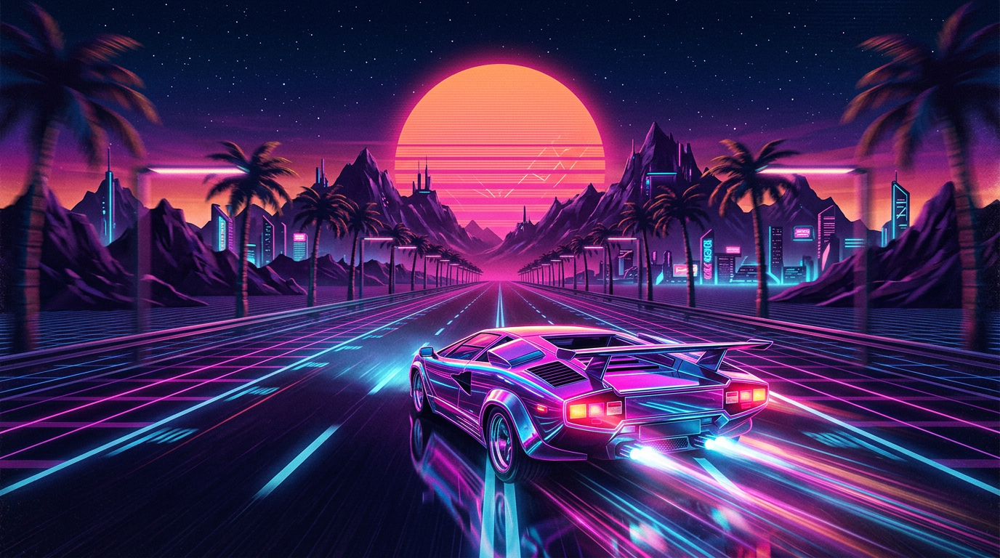

# NEON DRIFT

**Open-source AI street racer.** Generate a unique car with **Stable Diffusion**, then outrun traffic on a synthwave highway.



Play in the browser. No GPU. No API key. MIT licensed.

## Play

```bash
python -m venv .venv
source .venv/bin/activate   # Windows: .venv\Scripts\activate
pip install -r requirements.txt
python app.py
```

Gradio prints two links:

| Link | What it is |
| --- | --- |
| **Local** `http://127.0.0.1:7860` | Play on this machine |
| **Public** `https://xxxx.gradio.live` | Shareable link — anyone can play |

That public URL is created by Gradio (`share=True`). It is your own playable link. To skip it:

```bash
python app.py --no-share
```

### Deploy your own permanent link (Hugging Face Spaces)

1. Create a [Gradio Space](https://huggingface.co/spaces/new?sdk=gradio).
2. Push this repo (Space expects `app.py` + `requirements.txt`).
3. Your game is live at `https://huggingface.co/spaces/<you>/neon-drift`.

## How to play

| Key | Action |
| --- | --- |
| **W** / ↑ | Accelerate |
| **A D** / ← → | Steer |
| **S** / ↓ | Brake |
| **Space** | Nitro |
| **P** / Esc | Pause |

On a phone, use the on-screen buttons.

**Garage:** describe a car → pick **SDXL Turbo** (Stable Diffusion) or **Flux** → **Generate car** → **Race**. Quick Race uses a procedural neon car if you skip generation.

Dodge traffic, stay on the road, dump nitro for score. Three hits and you wreck.

## How the AI cars work

The garage talks to the public [Pollinations](https://pollinations.ai) image API from **your browser**:

- **SDXL Turbo** — Stability AI’s distilled Stable Diffusion (`model=turbo`)
- **Flux** — Black Forest Labs (`model=flux`)

Prompts are turned into a rear-view studio shot on a black background, then drawn on the highway with a screen blend so the car sits on the road. Nothing is uploaded to this server; generation is free and keyless.

The racer itself is a pseudo-3D OutRun-style engine (perspective road, curves, hills, sprites) running on a canvas.

## Project layout

```
app.py              # Gradio host — full-bleed game + public share link
game.html           # Self-contained game + AI garage (works standalone too)
requirements.txt
LICENSE             # MIT
docs/hero.png
```

You can open `game.html` directly in a browser. Gradio is what mints the shareable play link and is the Hugging Face Spaces entry point.

## License

MIT. Built to be forked, restyled, and raced.